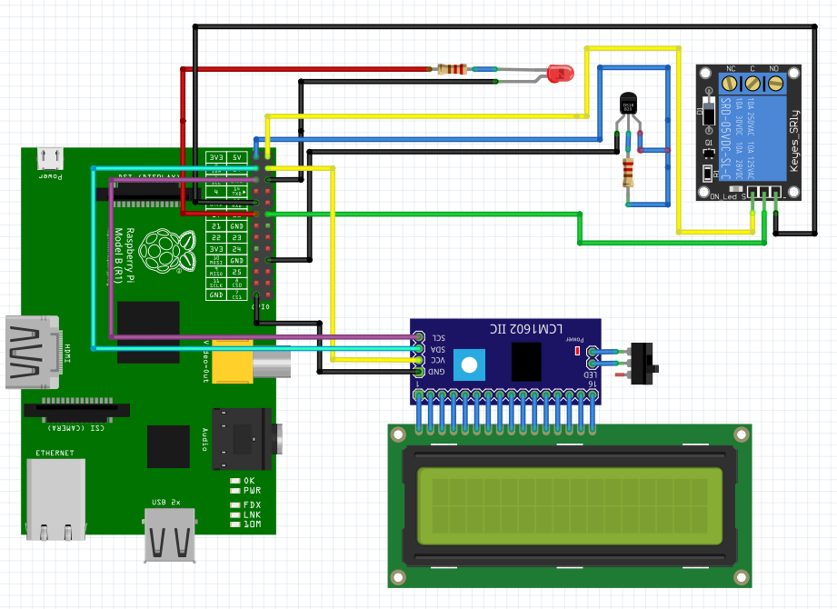

# RaspberryPi + AngularJS + Flask Boilerplate App

This is example project that shows how You can use Angular frontend and a Flask / python backend
on RaspberryPi platform with some extra periphery connected for building Your own smartHouse concept.

In this example I used:

- RaspberryPi type B 
- Led (5v) with one 300Ohm resistor
- Digital thermometer DS18b20 with one pull-up 4.7k resistor 
- Relay module
- HD44780 controller based LCD display via PCF8574 I2C port expander based module
  (Could be used various types of displays - 16x2, 20x4 and others pinout compatible)
- wires, soldering iron, etc...

Project contains also shell scripts for quick deployment on Raspi platform and basic functionality testing,
and neat tutorials, that will help You to setup Raspberry Pi to make possible using 1-Wire and I2C interfaces, etc.

### How to Get Started
1. [Connect all periphery according to this tutorial](#connect-all-periphery)
2. [Setup I2C interface on your RaspberryPI for LCD connection](#setup-i2c-interface-on-your-raspberrypi-for-lcd-connection)
3. [Setup 1-Wire interface on your RaspberryPI for LCD connection](#setup-1-wire-interface-on-your-raspberrypi-for-lcd-connection)
4. [Setup the application and environment](#setup-the-application-and-environment)
5. [Launch and have fun ;)](#launch-and-have-fun-\;\))  

----------
## Tutorial

### Connect all periphery

- Raspberry Pi pinout:


- Connection diagram:



[Back](#how-to-get-started)

----------
### Setup I2C interface on your RaspberryPI for LCD connection

First connect to Raspberry Pi by SSH.

To setup I2C interface on RaspberryPi You need to run the following commands:

```{r, engine='bash', count_lines}
sudo apt‐get install ‐y python‐smbus
sudo apt‐get install ‐y i2c‐tools
```

Then enable Kernel Support (with Raspi-Config) :
To do this enter :

```{r, engine='bash', count_lines}
sudo raspi-config
```

and follow the prompts to install i2c support for the ARM core and linux kernel.

Go to : 

`Advanced Options` -> `I2C`
  
 `Would you like the ARM I2C interface to be enabled?` -> `Yes`
 
 `Would you like the I2C kernel module to be loaded by default?` -> `Yes`

Then reboot : 

```{r, engine='bash', count_lines}
sudo reboot
```

Then open file `/etc/modules`

```{r, engine='bash', count_lines}
sudo nano /etc/modules
```

and ensure that these two lines to the end of the file:

```{r, engine='bash', count_lines}
i2c‐bcm2708
i2c‐dev
```

If not, add them at the end of file.

Depending on your distribution, you may also have a file called `/etc/modprobe.d/raspi-blacklist.conf`
If you do not have this file then there is nothing to do, however, if you do have this file, you need to
edit it and comment out the lines below:

```{r, engine='bash', count_lines}
blacklist spi‐bcm2708
blacklist i2c‐bcm2708
```

by putting a `#` in front of them.
Open an editor on the file by typing:

```{r, engine='bash', count_lines}
sudo nano /etc/modprobe.d/raspi‐blacklist.conf
```

If you are running a recent Raspberry Pi (3.18 kernel or higher) you will also need to update the
`/boot/config.txt` file. Edit it with : 

```{r, engine='bash', count_lines}
sudo vim /boot/config.txt
```

and add the text :

```{r, engine='bash', count_lines}
dtparam=i2c1=on
dtparam=i2c_arm=on
```

Once this is all done, reboot!

Testing I2C
Now when you log in you can type the following command to see all the connected devices

```{r, engine='bash', count_lines}
sudo i2cdetect ‐y 1
```

Output should look like this:

```{r, engine='bash', count_lines}
     0  1  2  3  4  5  6  7  8  9  a  b  c  d  e  f
00:          -- -- -- -- -- -- -- -- -- -- -- -- -- 
10: -- -- -- -- -- -- -- -- -- -- -- -- -- -- -- -- 
20: -- -- -- -- -- -- -- 27 -- -- -- -- -- -- -- -- 
30: -- -- -- -- -- -- -- -- -- -- -- -- -- -- -- -- 
40: -- -- -- -- -- -- -- -- -- -- -- -- -- -- -- -- 
50: -- -- -- -- -- -- -- -- -- -- -- -- -- -- -- -- 
60: -- -- -- -- -- -- -- -- -- -- -- -- -- -- -- -- 
70: -- -- -- -- -- -- -- --
```

This shows that one I2C address is in use – 0x27

Note that if you are using one of the very first Raspberry Pis (a 256MB Raspberry Pi Model B) then you
will need to change the command to:

```{r, engine='bash', count_lines}
sudo i2cdetect ‐y 0
```

The Raspberry Pi designers swapped over I2C ports between board releases. Just remember: 512M Pi's
use i2c port 1, 256M ones use i2c port 0!

[Back](#how-to-get-started)

----------
### Setup 1-Wire interface on your RaspberryPI for LCD connection

First connect to Raspberry Pi by SSH.

To setup 1-Wire interface on RaspberryPi You need to add 1-Wire support to /boot/config.txt .
Open this file in text editor:

```{r, engine='bash', count_lines}
sudo vim /boot/config.txt
```

and add this line to the end of file :

```{r, engine='bash', count_lines}
dtoverlay=w1‐gpio
```

Once it's done, save and reboot :

```{r, engine='bash', count_lines}
sudo reboot
```

After reboot test the sensor (DS18B20), adding `w1-gpio` and `w1-therm` modules to core:

```{r, engine='bash', count_lines}
sudo modprobe w1‐gpio
sudo modprobe w1‐therm
```

Then go to Onewire devices catalog and check available devices:

```{r, engine='bash', count_lines}
cd /sys/bus/w1/devices
ls
```

You should see something like this:

```{r, engine='bash', count_lines}
pi@raspberrypi /sys/bus/w1/devices $ ls
28-0000045ffcd9  w1_bus_master1
```

where `28-0000045ffcd9` is unique device id-number, in Your case thermometer.
Then enter this catalog and print out device data to the terminal:

```{r, engine='bash', count_lines}
cd 10‐0008019c26d2
cat w1_slave
```

You should see something like this:

```{r, engine='bash', count_lines}
9a 01 4b 46 7f ff 06 10 78 : crc=78 YES
9a 01 4b 46 7f ff 06 10 78 t=25625
```

where `t=25625` is current temperature (25.625 °C).

That's it :)

[Back](#how-to-get-started)

----------
### Setup the application and environment

1. clone this repo

2. install all the necessary packages (best done inside of a virtual environment)
> pip install -r dependencies.txt

In case You will have problems with Python package manager (PIP), resp. it'll be outdated (v 1.0.1),
You should manually install newer version:

```{r, engine='bash', count_lines}
wget https://pypi.python.org/packages/11/b6/abcb525026a4be042b486df43905d6893fb04f05aac21c32c638e939e447/pip-9.0.1.tar.gz
tar -xzvf pip-9.0.1.tar.gz
cd pip-9.0.1
sudo python3 setup.py install
```

In case You will have problems with dependencies installation because of proxies, tun this command:
> sudo pip install -i https://pypi.python.org/simple/ -r dependencies.txt 

3. run the app
> python runserver.py

4. create and seed the db (the server must still be running, so open a new terminal window first)
> python manage.py create_db && python manage.py seed_db --seedfile 'data/db_items.json'

In case You want to use MySql database:

> sudo apt-get install python-mysqldb

Then from Mysql client tun this command:
> GRANT ALL PRIVILEGES ON *.* TO 'root'@'%' IDENTIFIED BY 'root' WITH GRANT OPTION;

5. check out your blog
> http://localhost:5000/blog

[Back](#how-to-get-started)

----------
### Launch and have fun ;)

## Here comes the fun :D


[Back](#how-to-get-started)

----------

